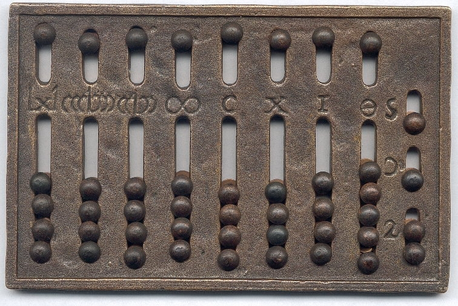
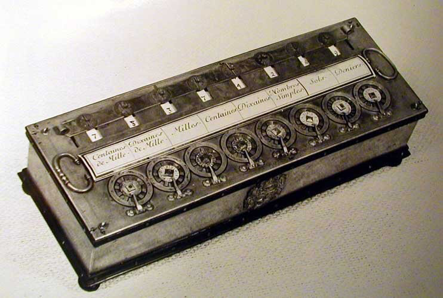
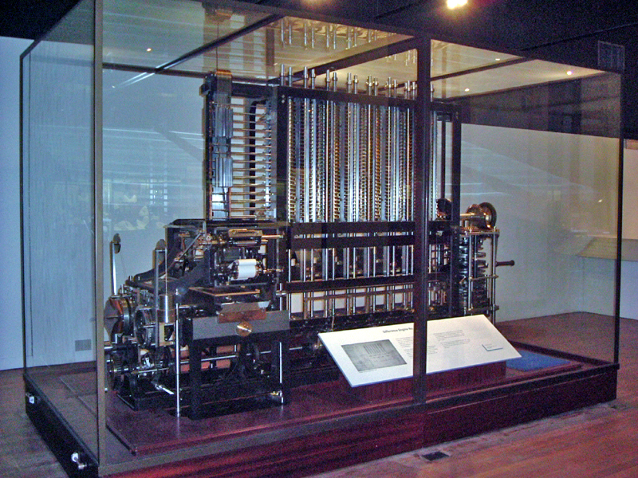
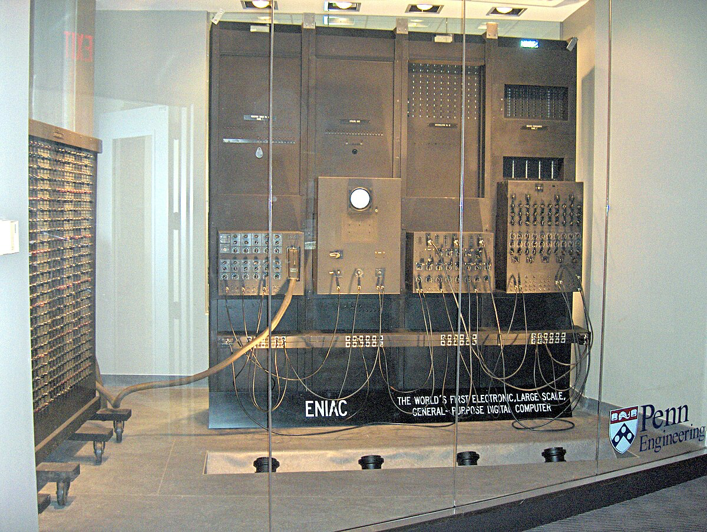
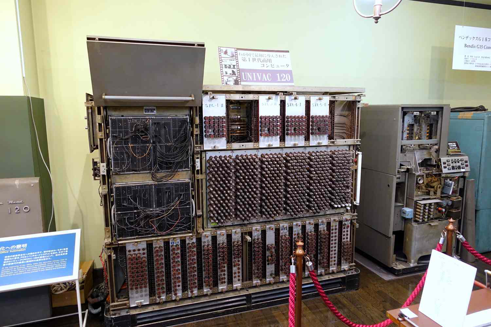
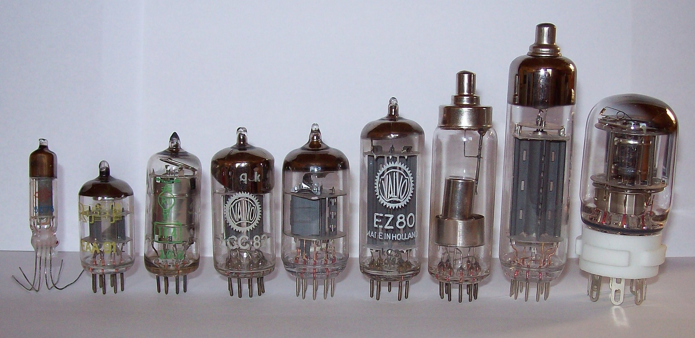
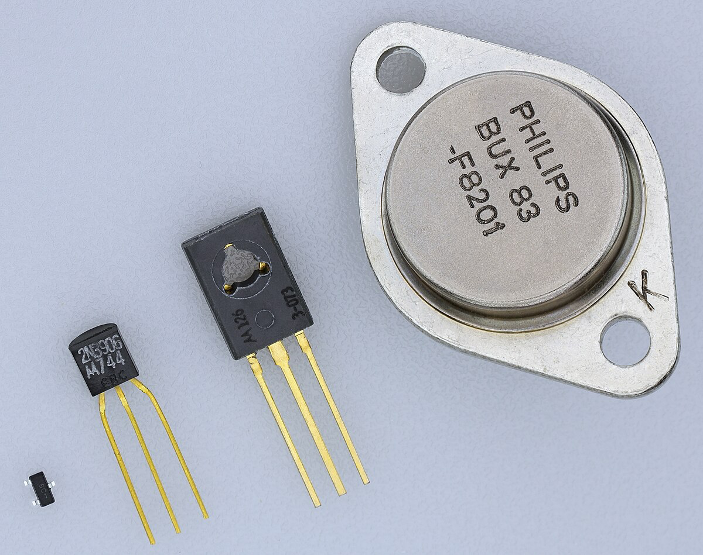
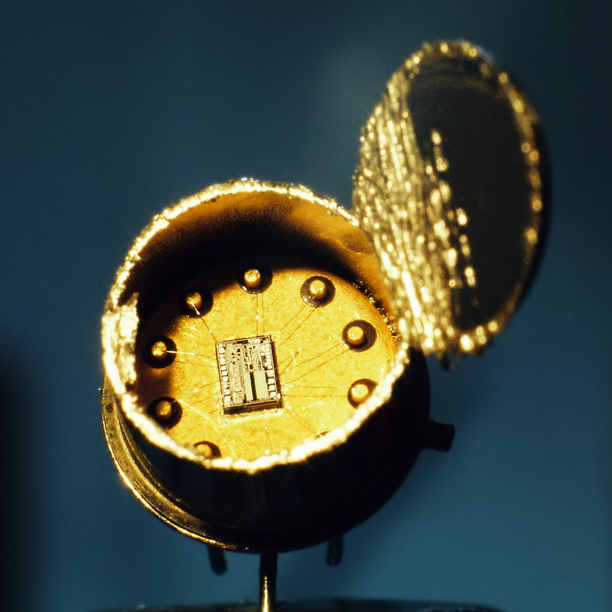
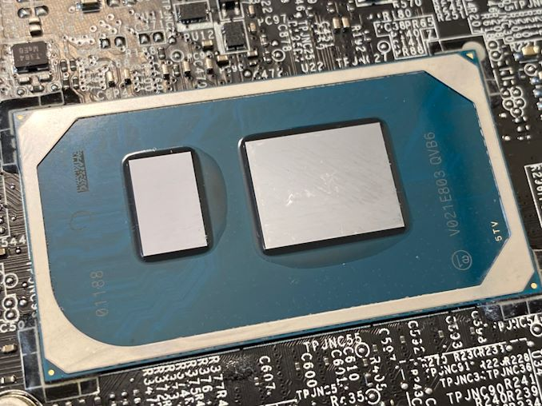
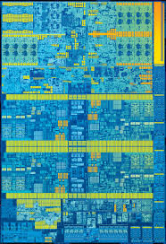

# Раздел 1. Вычислительные приборы и устройства

## Тема 1.1. Классы вычислительных машин

### История развития вычислительных устройств и приборов

#### 1. Древние и механические вычислительные устройства

**Абак (абакус)**: Одно из самых древних средств вычислений, использовавшееся в Месопотамии, Китае, Египте и других древних цивилизациях. Абакус представлял собой раму с рядами бусин, которые перемещались для выполнения арифметических операций.

**Механические счетные устройства**: В XVI-XVII веках появились первые механические счетные устройства. **Блез Паскаль** изобрел Паскалину – механический счетчик, способный выполнять сложение и вычитание. **Готфрид Вильгельм Лейбниц** усовершенствовал эту идею, создав счётную машину, которая могла выполнять умножение и деление.

**Чарльз Бэббидж**: В XIX веке Бэббидж предложил концепцию аналитической машины – предшественника современных компьютеров, способного выполнять сложные вычисления по заранее заданным программам. Хотя машина так и не была полностью построена, её идеи легли в основу последующих разработок.

#### 2. Электромеханические вычислительные устройства

**Хомдарч Эрли**: В 1930-х годах Эрли разработал первые электрические счетные машины, использующие ротационные контакты и электрические импульсы для выполнения вычислений.

**Алан Тьюринг**: В 1936 году предложил концепцию универсальной машины Тьюринга, которая стала теоретической основой для разработки программируемых компьютеров.

**Конрад Цузе**: В 1941 году немецкий инженер Цузе создал Z3 – первый полностью автоматический, программируемый и цифровой компьютер, использующий реле для обработки данных.

#### 3. Электронные вычислительные машины (ЭВМ)

**ENIAC**: Один из первых электронных универсальных компьютеров, разработанный в США в 1946 году. Он использовал вакуумные лампы и мог выполнять тысячи операций в секунду.

**UNIVAC**: Первый коммерчески успешный компьютер, созданный в 1951 году. Он использовался для обработки данных переписи населения и других коммерческих задач.

#### 4. Поколения компьютеров {#generations}

Развитие вычислительных устройств принято разделять на несколько поколений, каждое из которых характеризуется использованием определенных технологий.

**Первое поколение (1940-1956)**:

- **Технологии**: Вакуумные лампы.
  
- **Характеристики**: Большие размеры, высокое энергопотребление, низкая надежность.
- **Примеры**: ENIAC, UNIVAC I.

**Второе поколение (1956-1963)**:

- **Технологии**: Транзисторы.
  
- **Характеристики**: Меньшие размеры, повышенная надежность, снижение энергопотребления.
- **Примеры**: IBM 1401, PDP-1.

**Третье поколение (1964-1971)**:

- **Технологии**: Интегральные схемы (ИС).
  
- **Характеристики**: Ещё меньшие размеры, более высокая производительность, появление операционных систем.
- **Примеры**: IBM System/360, DEC PDP-8.

**Четвёртое поколение (1971-настоящее время)**:

- **Технологии**: Микропроцессоры, большие интегральные схемы.
  
  
- **Характеристики**: Миниатюризация, массовое производство, персональные компьютеры.
- **Примеры**: IBM PC, Apple Macintosh.

**Пятое поколение (настоящее время и будущее)**:

- **Технологии**: Искусственный интеллект, квантовые вычисления, нейроморфные чипы.
  
- **Характеристики**: Самообучающиеся системы, обработка естественного языка, интеграция с облачными технологиями.
- **Примеры**: Современные ИИ-системы, квантовые компьютеры IBM Q.

### Классификация ЭВМ

Компьютеры классифицируются по различным признакам, включая принцип действия, поколение, назначение, размер и функциональные возможности.

#### 1. Классификация по принципу действия

**Цифровые компьютеры**: Обрабатывают информацию в двоичной системе, используя дискретные значения (0 и 1). Примеры: все современные ЭВМ, от суперкомпьютеров до смартфонов.

**Аналоговые компьютеры**: Обрабатывают информацию в непрерывных значениях. Используются для моделирования физических процессов, например, в авиации и инженерии.

**Гибридные компьютеры**: Сочетают в себе черты цифровых и аналоговых систем, позволяя выполнять как дискретные, так и непрерывные вычисления.

#### 2. Классификация по поколениям

См. [выше](#4-поколения-компьютеров) 

#### 3. Классификация по назначению

**Универсальные (общего назначения) компьютеры**: Могут выполнять широкий спектр задач, ограниченный лишь программным обеспечением. Примеры: персональные компьютеры, серверы, суперкомпьютеры.

**Специализированные компьютеры**: Разработаны для выполнения определенных задач или функций. Примеры: встроенные системы (embedded systems) в бытовой технике, промышленности, медицинском оборудовании.

**Суперкомпьютеры**: Обладают чрезвычайно высокой вычислительной мощностью и используются для сложных научных и инженерных задач, таких как моделирование климата, ядерных реакций и т.д.

**Мейнфреймы**: Большие и мощные компьютеры, используемые в крупных организациях для обработки больших объемов данных и поддержки множества пользователей одновременно.

**Миникомпьютеры**: Среднего размера системы, которые использовались в 1960-1980-х годах для поддержки малых предприятий и научных учреждений.

**Персональные компьютеры (ПК)**: Компьютеры, предназначенные для индивидуального использования. Включают настольные и портативные устройства (ноутбуки).

#### 4. Классификация по размерам

**Суперкомпьютеры**: Самые крупные и мощные компьютеры, занимающие целые помещения и потребляющие огромные объемы энергии.

**Мейнфреймы**: Большие системы, используемые в корпоративных центрах для обработки больших данных.

**Миникомпьютеры**: Средние по размеру компьютеры, использовавшиеся для многозадачной обработки данных в малых и средних предприятиях.

**Персональные компьютеры**: Компактные устройства, предназначенные для индивидуального использования в домашних и офисных условиях.

**Микрокомпьютеры**: Маленькие компьютеры, включающие микропроцессоры. Включают персональные компьютеры и встроенные системы.

#### 5. Классификация по функциональным возможностям

**Однозадачные компьютеры**: Могут выполнять только одну задачу в данный момент времени. Пример: ранние компьютеры первого поколения.

**Многозадачные компьютеры**: Способны выполнять несколько задач одновременно, переключаясь между ними. Примеры: современные операционные системы (Windows, Linux, macOS).

**Многопользовательские компьютеры**: Обеспечивают доступ к ресурсам системы для нескольких пользователей одновременно. Примеры: серверы, мейнфреймы.

**Однопользовательские компьютеры**: Предназначены для использования одним пользователем за раз. Пример: персональные компьютеры.

**Распределенные системы**: Компьютеры, объединенные в сеть и работающие совместно для выполнения общих задач. Примеры: облачные вычисления, кластеры серверов.
